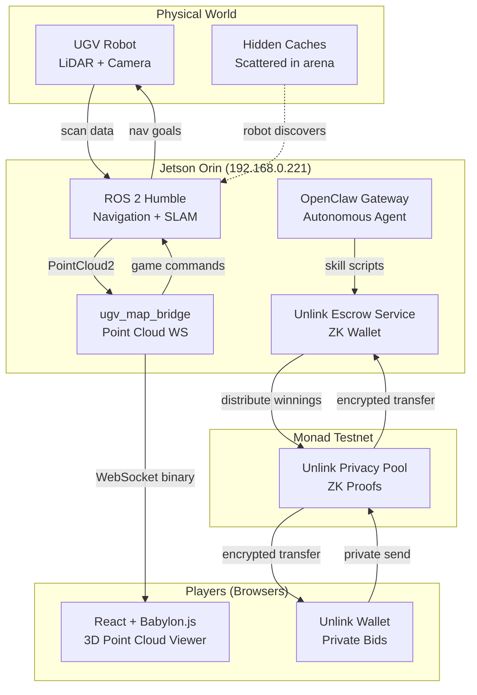
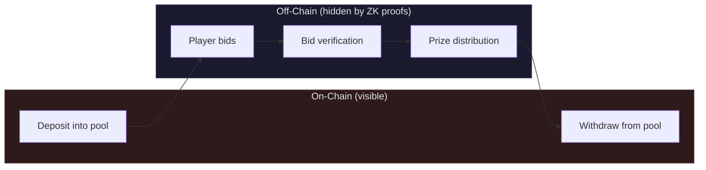

# smolseek

A privacy-preserving claw machine game where a real robot explores physical space, players place hidden bids on targets, and winnings are distributed through zero-knowledge proofs — all on [Monad testnet](https://monad.xyz).

Built with [OpenClaw](https://openclaw.ai) + [Unlink](https://unlink.xyz) + [ROS 2](https://docs.ros.org/) + [Babylon.js](https://www.babylonjs.com/).

## How It Works



## Game Flow

```mermaid
sequenceDiagram
    participant P as Players
    participant C as Coordinator
    participant R as Robot
    participant E as Escrow (Unlink)

    rect rgb(40, 30, 60)
        Note over P,C: LOBBY
        P->>C: Join game
        C->>C: Wait for players
    end

    rect rgb(30, 40, 55)
        Note over P,E: DEPOSIT
        P->>E: Fund escrow (private send)
        E->>E: Sync incoming transfers
    end

    rect rgb(30, 55, 40)
        Note over P,R: PLAY (per round)
        C->>C: Open bidding (30s)
        P->>E: Place hidden bids (ZK)
        E->>E: Verify bids via relay
        C->>C: Highest confirmed bid wins
        C->>R: Navigate to target cache
        R->>R: Drive to cache location
        R-->>C: Arrived / collected
        C->>E: Distribute winnings to winner
    end

    rect rgb(55, 40, 30)
        Note over P,C: END
        C->>P: Final leaderboard
    end
```



## Architecture

```
smolseek/
├── src/ugv_map_bridge/          # ROS 2 package — SLAM bridge + WS server
├── game/
│   ├── coordinator/             # Python game FSM (LOBBY→DEPOSIT→PLAY→END)
│   ├── web/                     # React + Babylon.js + Storybook
│   │   ├── src/components/      # 11 UI components
│   │   ├── src/stories/         # 9 story files (30+ variants)
│   │   └── .storybook/          # Storybook 10 config
│   ├── unlink-service/          # Express escrow service (@unlink-xyz/node)
│   ├── openclaw-unlink/         # OpenClaw skill module (8 shell scripts)
│   └── tests/                   # Integration tests + mocks
└── JETSON_MANIFEST.md           # Robot hardware + ROS2 topic reference
```

| Layer | Tech | Role |
|-------|------|------|
| **Robot** | ROS 2 Humble, Nav2, LiDAR, Stella VSLAM | Explore arena, navigate to targets |
| **Bridge** | Python, WebSocket, msgpack | Stream point cloud + game commands |
| **Coordinator** | Python asyncio | Game FSM, round management, bid resolution |
| **Web UI** | React 19, Babylon.js 8, Vite, Storybook 10 | 3D viewer, bid panel, leaderboard |
| **Escrow** | Express 5, TypeScript, SQLite | ZK wallet, bid verification, prize distribution |
| **Skill** | Shell scripts (curl + jq) | OpenClaw agent interface to escrow |
| **Privacy** | Unlink Protocol, ZK proofs | Hidden bids + private payouts on Monad |

## Quick Start

### 1. Robot side (Jetson)

```bash
ssh jetson@192.168.0.221
# ROS2 stack auto-starts via systemd
# OpenClaw gateway runs on :3000
```

### 2. Escrow service

```bash
cd game/unlink-service
npm install
npm run dev          # → http://localhost:3001
```

### 3. Game coordinator

```bash
cd game/coordinator
pip install -r requirements.txt
python -m coordinator     # WS on :8081
```

### 4. Web UI

```bash
cd game/web
npm install
npm run dev          # → http://localhost:5173
npm run storybook    # → http://localhost:6006
```

## Privacy Model



All player transfers route through the Unlink privacy pool. On-chain observers see pool interactions but **never** who bid, how much, or who won. The escrow service verifies bids by polling the relay for confirmation — it doesn't need to know the sender.

## Components (Storybook)

| Component | Description |
|-----------|-------------|
| `MapViewer` | Live Babylon.js 3D point cloud with height coloring, trajectory, cache markers |
| `MockMapViewer` | Simulated scanning robot for Storybook demos |
| `WalletPanel` | Join game, show address + balance |
| `BidPanel` | Select cache, enter amount, submit private bid |
| `RoundInfo` | Round counter, countdown, phase badge, nav status |
| `Leaderboard` | Ranked player scores |
| `TransactionStatus` | Relay ID tracker with ZK proof phase indicators |
| `CacheCard` | Single cache display (value, coords, collected status) |
| `EscrowPool` | Live balance + address with copy |
| `ConnectionBadge` | WebSocket + escrow health dots |
| `SpectatorView` | Fullscreen 3D mode for projector display |

## OpenClaw Skill Scripts

The `openclaw-unlink/` skill module lets the robot's AI agent manage payments autonomously:

| Script | What it does |
|--------|-------------|
| `unlink-status.sh` | Health check + escrow summary |
| `unlink-address.sh` | Get escrow Unlink address |
| `unlink-balance.sh` | Check token balance |
| `unlink-sync.sh` | Re-scan relay for incoming transfers |
| `unlink-bid-verify.sh` | Verify a player's private bid by relay ID |
| `unlink-bid-list.sh` | List confirmed bids for a round |
| `unlink-distribute.sh` | Send winnings (double-send protected) |
| `unlink-pool.sh` | Combined address + balance |

Standalone module: [superposition/openclaw-unlink](https://github.com/superposition/openclaw-unlink)

## Hardware

- **Robot:** Waveshare UGV Beast, Jetson Orin Nano
- **LiDAR:** LD19 2D LiDAR (360°)
- **Camera:** USB monocam (Stella VSLAM)
- **Compute:** Jetson Orin Nano 8GB + laptop coordinator

## Links

- [Unlink Protocol](https://unlink.xyz) — privacy-as-a-service for EVM chains
- [OpenClaw](https://openclaw.ai) — autonomous AI agent platform
- [Monad](https://monad.xyz) — high-performance EVM L1
- [Babylon.js](https://www.babylonjs.com/) — 3D engine for the web
- [ROS 2 Humble](https://docs.ros.org/en/humble/) — robot middleware
